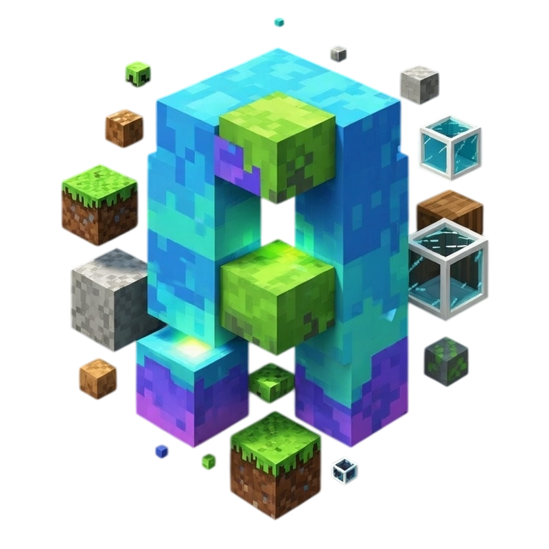

<h1 align="center">AwesomeCraft Launcher</h1>

<em><h5 align="center">(formerly Electron Launcher)</h5></em>

[
](https://github.com/Alo3-gh/AwesomeCraftLauncher/actions)  

Join modded servers without worrying about installing Java, Forge, or other mods.

<!--

-->
## Downloads

You can download from [GitHub Releases](https://github.com/Alo3-gh/AwesomeCraftLauncher/releases)

#### Latest Release

#### Latest Pre-Release

**Supported Platforms**

If you download from the [Releases](https://github.com/Alo3-gh/AwesomeCraftLauncher/releases) tab, select the installer for your system.

| Platform | File |
| -------- | ---- |
| Windows x64 | `Awesome-Launcher-setup-VERSION.exe` |
| macOS x64 | `Awesome-Launcher-setup-VERSION-x64.dmg` |
| macOS arm64 | `Awesome-Launcher-setup-VERSION-arm64.dmg` |
| Linux x64 | `Awesome-Launcher-setup-VERSION.AppImage` |

## Resources
The best way to contact the developers is on Discord.

[][discord]

---

### See you ingame.

[discord]: https://discord.gg/playwithserch 'Discord'
[source project]: https://github.com/dscalzi/HeliosLauncher 'source project'
